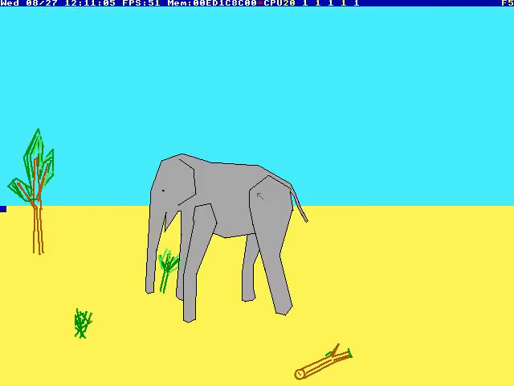

# MergePics.sh
Merge seqentually named (1.png 2.png) images in $PWD to a single image horizontally or vertically while sesizing to fill empty space and avoid "borders".

# Example
	$ ls -1
	a.jpeg
	b.png

a.jpeg (640x480):

b.png (256x256):

	$ MergePics.sh -h

output:

